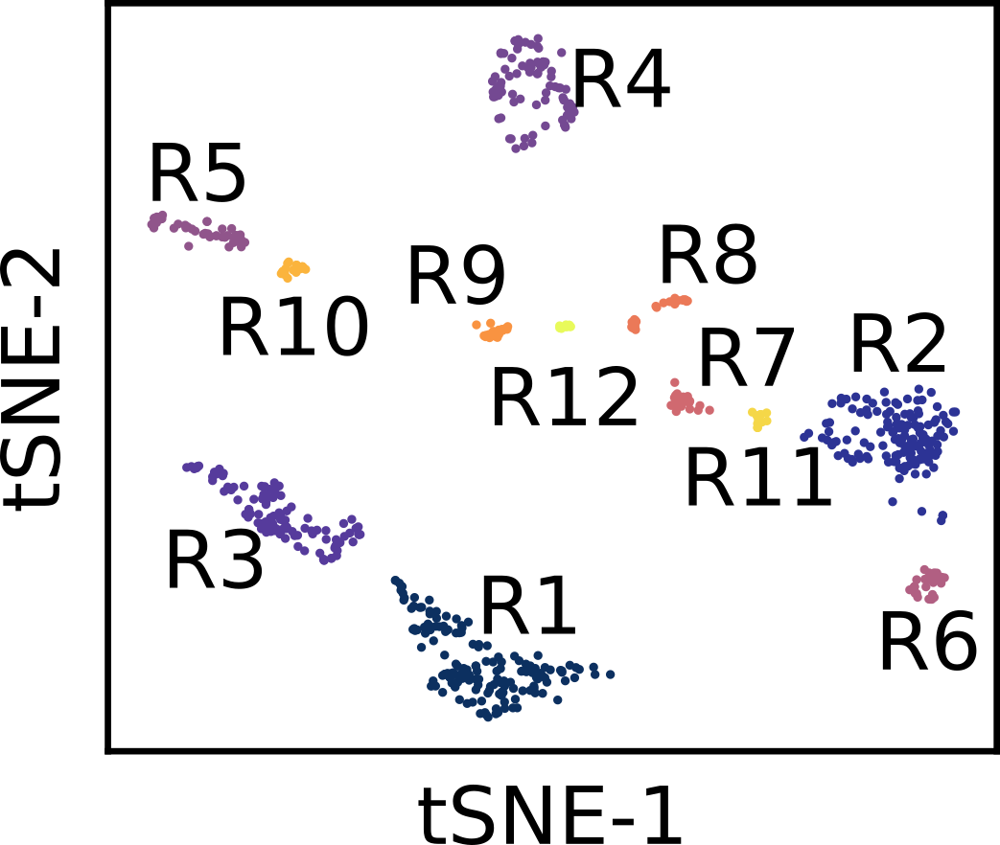
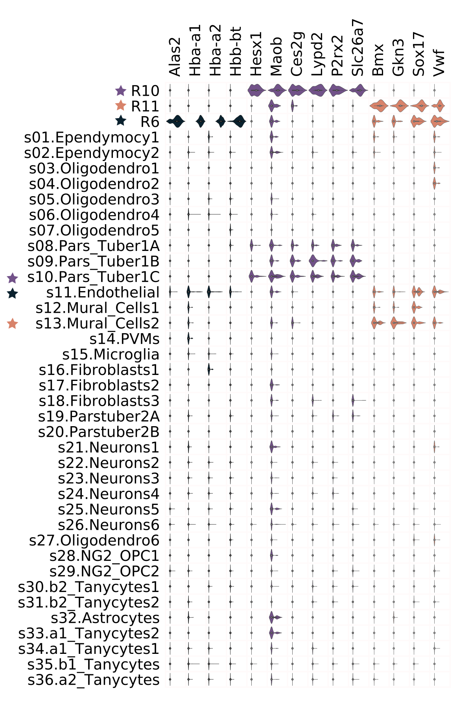

# FiRE - Finder of Rare Entities
## Contents
   [Installation Guide](#install)<br />
     -[Prerequisites](#pre)<br />
     -[Installation Steps of FiRE software](#install-steps)<br />
   [Data Pre-processing](#data-pre-processing)<br />
   [python API](#python-api)<br/>
   [R API](#r-api)<br />
   [Usage of FiRE](#usage-of-fire-software)<br />

<a name="install"></a><h1>Installation Guide</h1>

<a name="pre"></a><h2>Prerequisites</h2>

FiRE is available for `python` and `R`. Required versions and modules for both are as mentioned below. `cpp` modules are necessary for both of them.

1. <h3>Required python modules</h3>
```python
    python 2.7.12
    cython >= 0.23.4
    distutils >= 2.7.12
    numpy >= 1.13.3
    pandas >= 0.20.3
    statsmodels >= 0.8.0
```

2. <h3>Required R modules</h3>
```R
    R >= 3.2.3
    Rcpp >= 0.12.19
```

3. <h3>Required cpp modules</h3>
```cpp
    g++ >= 4.8.4
    boost >= 1.54.0
```
FiRE only needs `<boost/random.hpp>` from boost. So, full installation is not necessary. It can be downloaded from [boost.org](https://www.boost.org/) and used as is.

<a name="install-steps"></a><h2>Installation Steps of FiRE software</h2>

```bash
    [sudo] ./INSTALL [ --boost-path <boost-path> | --log-file <log-file> | --inplace | --py | --R | --help ]
    [sudo] ./UNINSTALL_python
    [sudo] ./UNINSTALL_R

    --boost-path <boost-path>  : python | R    : Path to boost-library, if boost is not installed at default location, this value needs to be provided.
    --inplace                  : python        : Required only for python, if set, inplace build will be run and resulting lib will be stored in python/FiRE.
    --log-file <log-file>      : python        : Required only for python, ignored with --inplace set.
    --py                       : python        : Install FiRE in python environment.
    --R                        : R             : Install FiRE in R environment.
    --help                     : python | R    : Display this help.

    Info:

    UNINSTALL_[python | R] files are generated upon installation.
```

<h3>If boost is installed at default location</h3>

```bash
    sudo ./INSTALL [ --py | --R ]
```

<h3>If boost is installed at custom location</h3>

```bash
    sudo ./INSTALL --boost-path <full-path> [ --py | --R ]

```
Example:
```bash
    sudo ./INSTALL --boost-path $HOME/boost/boost_1_54_0 [ --py | --R ]
```
[Only Python] Above installation steps will generate `fireInstall.log` file. It is advisable to keep this file, since it will be needed for uninstallation. Name of the log file can be modified during installation.

```bash
    ./INSTALL --log-file <log-file-name> [--py]
```

Above steps will install `FiRE` at the default location.

<h3>[Only Python] For `inplace` installation</h3>

```bash
    ./INSTALL --inplace [--py]
```

<h3> Uninstallation of FiRE Software.</h3>

```bash
    [sudo] ./UNINSTALL_python
    [sudo] ./UNINSTALL_R
```

<a name="data-pre-processing"></a><h1>Data Pre-processing</h1>
1. <h3>Load python libraries</h3>
```python
import numpy as np
```

2. <h3>Load Data in current environment.</h3>
```python
#Data matrix should only consist of values where rows represent cells and columns represent genes.
```

3. <h3>Copy preprocess.py in current working directory and load preprocess.</h3>
```python
import preprocess as pp
```

4. <h3> Call function ranger_preprocess for selecting thousand variable genes.</h3>
```python
preprocessedData, selGenes = pp.ranger_preprocess(data, genes, ngenes_keep=1000, dataSave='./', optionToSave=False, minLibSize=0, verbose=True)
```

|Parameter | Description | Required or Optional| Datatype | Default Value |
| -----:| -----:| -----:|-----:|-----:|
|data | Data for processing | Required | `np.array [nCells, nGenes]` | - |
|genes | Names of Genes | Required | `np.array [nGenes]` | - |
|ngenes_keep | Number of genes to keep | Optional | `integer` | 1000 |
|dataSave | Path to save results | Optional | `string` | Current working Directory (Used only when optionToSave is True) |
|optionToSave | Save processed output or not | Optional | `boolean` | False(Does not save) |
|minLibSize | Minimum number of expressed features | Optional | `integer` | 0 |
|verbose | Display progress | Optional | `boolean` | True(Prints intermediate results) |

```python
'''
Returned Value :
    preprocessedData : processed data matrix (log2 transformed) : np.array [nCells, nVariableGenes]
    selGenes         : Names of thousand variable genes selected : np.array [nVariableGenes]
'''
```

<a name="python-api"></a><h1>python API</h1>
1. <h3>Load python module of FiRE software.</h3>
```python
import FiRE
```

2. <h3>Create model of FiRE.</h3>
```python
model = FiRE.FiRE(L=100, M=50, H=1017881, seed=5489, verbose=0)
```

|Parameter | Description | Required or Optional| Datatype | Default Value |
| -----:| -----:| -----:|-----:|-----:|
|L | Total number of estimators | Required | `int` | - |
|M | Number of features to be randomly sampled for each estimator | Required | `int` | - |
|H | Number of bins in hash table | Optional | `int` | 1017881|
|seed | Seed for random number generator | Optional | `unsigned int` | 5489|
|verbose | Controls verbosity of program at run time (0/1) | Optional | `int` | 0 (silent) |

3. <h3>Apply model to the above dataset.</h3>
```python
model.fit(preprocessedData)
```

4. <h3>Calculate FiRE score of every cell.</h3>
```python
score = np.array(model.score(preprocessedData))
```

5. <h3>Access to model parameters.</h3>
Sampled dimensions can be accessed via
```python
# type : 2d list
# shape : L x M
model.dims
```
Chosen thresholds can be accessed via
```python
# type : 2d list
# shape : L x M
model.thresholds
```

Weights can be accessed via
```python
# type : 2d list
# shape : L X M
model.weights
```

Hash tables can be accessed via
```python
# type : 3d list
# shape : L x H x <dynamic>
# <dynamic> : as per number of samples in a bin (H) for a given estimator (L).
model.bins
```

<a name="r-api"></a><h1>R API</h1>
1. <h3>Load R module of FiRE software.</h3>
```R
library('FiRE')
```
2. <h3>Create model of FiRE.</h3>
```R
# model <- new(FiRE::FiRE, L, M, H, seed, verbose)
model <- new(FiRE::FiRE, 100, 50, 1017881, 5489, 0)
```

|Parameter | Description | Required or Optional| Datatype | Default Value |
| -----:| -----:| -----:|-----:|-----:|
|L | Total number of estimators | Required | `int` | - |
|M | Number of features to be randomly sampled for each estimator | Required | `int` | - |
|H | Number of bins in hash table | Optional | `int` | 1017881|
|seed | Seed for random number generator | Optional | `int` | 5489|
|verbose | Controls verbosity of program at run time (0/1) | Optional | `int` | 0 (silent) |

3. <h3>Apply model to the above dataset.</h3>
```R
model$fit(preprocessedData)
```
Acceptable datatype is of `matrix` class and of `type` `double` (`Numeric matrix`).

4. <h3>Calculate FiRE score of every cell.</h3>
```R
# Returns a numeric vector
score <- model$score(preprocessedData)
```

5. <h3>Access to model parameters.</h3>
Sampled dimensions can be accessed via
```R
# type : Integer matrix
# shape : L x M
model$d
```
Chosen thresholds can be accessed via
```R
# type : Numeric matrix
# shape : L x M
model$ths
```

Weights can be accessed via
```R
# type : Numeric matrix
# shape : 0 x 0
model$w

# Internally this vector is represented as unsigned int.
# Since R does not have unsigned data type. This function return a blank matrix.
# instead, it prints the matrix if number of elements is less than or equal to 100.
# Though FiRE provides API to save the weight matrix.
model$dump_w(filename)

```

Hash tables can be accessed via
```R
# type : List
# shape : L x H x <dynamic>
# <dynamic> : as per number of samples in a bin (H) for a given estimator (L).
model$b
```


<a name="usage-of-fire-software"></a><h1>Usage of FiRE Software</h1>
1. <h3>Select cells with higher values of FiRE score, that satisfy IQR-based thresholding criteria. </h3>
```python
scoreFile = 'Results/score_hypothalamus.txt'
np.savetxt(scoreFile,score) #Save scores

from scipy import stats

q3 = np.percentile(score, 75)
iqr = stats.iqr(score)
th = q3 + 1.5*iqr

indIqr = np.where(score >= th)[0]

dataSel = preprocessedData[indSel,:] #Select subset of cells
dataSelFile = 'Results/dataSel_hypothalamus.txt'
np.savetxt(dataSelFile,dataSel)
```

6. <h3>Run [dropClust](https://github.com/debsin/dropClust) and predict rare clusters.</h3>
    <!---->
    

7. <h3>Find genes up-regulated for predicted rare clusters.</h3>


<!---->

